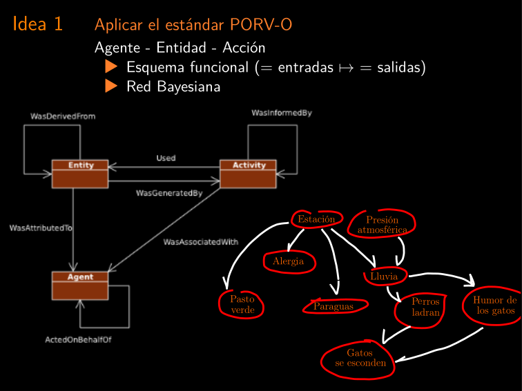

# Tres ideas en torno a la reproducibilidad de los procesamientos geodésicos.

### Javier José Clavijo

| jclavijo@fi.uba.ar |

<!-- https://github.com/jjclavijo/3ideas2022sirgas -->

### Universidad de Buenos Aires - Facultad de Ingeniería

La charla habla principalmente sobre ideas para mejorar los flujos de datos
para que sean más reproducibles (y varios conceptos asociados que ya veremos).

El hilo conductor es la situación que me motivó a generar este trabajo.

Habiéndome propuesto aplicar métodos bayesianos al calculo del marco de
referencia a partir de soluciones diarias o semanales caí en cuenta que lo
primero que tenía que entender bien era cuales son los supuestos del modelo y
que distribuciones a-priori implican, incluyendo las correlaciones entre todos
los parámetros que entran en juego.

Aquí topamos con algunas dificultades a la hora de analizar y comparar los
procesamientos publicados. Se hace dificil decidir si determinado conjunto de
datos publicado es apto para un objetivo concreto, porque no podemos saber si
hay correlaciones no declaradas que nos puedan afectar el resultado si no
sabemos cómo se relacionan con sus datos de entrada. (o no sabemos qué
datos de entrada tiene)

<!---

> ## Motivación (origen)
>
> - Posiciones, en un MR,
>   $\longleftrightarrow$ $\underset{x}{\arg\max} P(X|\text{\footnotesize datos})$
>   [Marcos de referencia geodésicos: un enfoque Bayesiano; JJ Clavijo, JF Martínez](https://cms.fi.uba.ar/uploads/Libro_SE_Vy_T_2021_VERSION_FINAL_add8815fd9.pdf)
>
> - Si resuelvo X por Pedazos (ej: órbitas $\rightarrow$ $X_0$)
>
> - $P(X_1|\text{\footnotesize datos}) = P(X_1|\text{\footnotesize datos},X_0)$
>   - $\mapsto$ condicionar a los parámetros fijos es igual a la marginalizar.
>   - $\mapsto$ $X_1$ y $X_0$ son condicionalmente independientes a los datos.
>   - No pasa si hay datos compartidos.
>
> - $\mapsto$ Necesito saber si $P(X_0,\text{datos}) = P(X_0)P(\text{datos}) \forall  \text{modelos}$
>
> - Y necesito sistematizarlo.

--->

Puesto más formal, necesitamos saber si las distibuciones de los parámetros
provienen de condicionar unos a otros, marginalizar o si en algun caso
ambas cosas son equivalentes (es decir que los parámetros son independientes).

Ya vamos a ver por que importa marginalizar o condicionar.

<!-- Es importante remarcar que se CONDICIONA cuando se eliminan columnas de ATPA y
se MARGINALIZA cuando se eliminan columnas de SIGMA. -->

La principal dificultad para identificar esto es la gran variedad de software
y las dificultades para seguir exactamente el proceso que hacen.

Incluso el proceso de lectura de datos y la forma en que los manejan es
diferente en todos. Por ejemplo, las estructuras de lectura y uso de datos
de RTKLib y G-Nut son radicalmente diferentes. (no solo por las diferencias
en la lógica de C y C++)

Esto aveces dificulta que se pueda aprender los procesos asociándolos a lo que
está pasando por detrás en lugar de generar "rutinas" y "automatizarlo".

<!---

## Motivación (origen)

Al analizar trabajos publicados aparece

- Software específico.
- Formas de leer y estructurar datos siempre nuevas.
- Nomenclatura especial.
- Términos y Métodos "heredados"

Puede dificultarse

- Aprender por asociación
- Reproducir experimentos
- Validar Resultados

--->

Como consecuencia de este problema surge la idea de plantear esquemas par
describir los procesos y flujos de trabajo.

Aquí se abren dos ramas importantes.

Por un lado los estándares de "data provenance" que indican formas de describir
los procesos en forma sistemática.

Como introducción ver los links que siguen:

- [https://www.w3.org/TR/prov-dm/](https://www.w3.org/TR/prov-dm/)
- [http://videolectures.net/iswc2014_gil_semantic_challenges/](http://videolectures.net/iswc2014_gil_semantic_challenges/) minuto 18:00 en adelante

Por otro lado, las redes bayesianas son una forma de describir procesos modelos
estadísticos en función de relaciones causales. Podemos ver que, si conjuntos
de datos comparten relaciones causales con algún juego de parámetros no
deberíamos tratarlos como si fueran independientes sino sólo
condicionalmente independientes.

<!---
## Lógica

### Premisas

- Formatos estándar de Intercambio $\in$ Geodesia
- Flujos de datos estandarizados $\notin$ Geodesia
- $\exists$ W3C PROV Standard
- $\exists$ Metodos Bayesianos - Redes Bayesianas, etc
- $\exists$ Métodos de validación, Herramientas genéricas de procesamiento y transmisión de datos

--->

En cuanto al procesamiento GNSS, que tomamos como ejemplo, podemos hacer algunas
observaciones adicionales.

1. Los datos de observación pueden representarse como un tensor ralo.
Cada modelo paramétrico que contribuye al modelo de observación parte de
un espacio de parámetros bien acotado y genera un tensor denso de la misma
dimensión que el tensor de observaciones.

2. Los resultados son generalmente estimadores de los parámetros que se
consideran como si provinieran de una normal multivariada.

Esto nos da dos líneas generales importantes para describir los procesos en
función de las transformaciones que sufren los tensores y las formas en que
los parámetros se relacionan con los tensores que generan.

<!---

## Lógica

### Observando que

- Datos de Observacion $\mapsto$ Tensor Ralo o Columnar Format (índice: t).
- Modelos paramétricos $\mapsto$ Conjuntos de parámetros $\mapsto$ Tensor Denso o Columnar Format (índice: t).
- Resultados $\mapsto$ $\mu,\Sigma$ de una $\mathcal{N}$ (hoy).

--->

La propuesta es entonces, pensando las entradas como segmentables en el tiempo,
(lo cual adicionalmente permitiría un esquema de paralelización), describir los
flujos de trabajo en forma funcional (misma entrada = misma salida), y usar
las herramientas existentes para generar formas de validar los datos y los
productos generados, identificar y describir las dependencias, etc.

<!---
## Lógica

### Podemos plantear

- Segmentación en función del tiempo (con Herramientas Genéricas)
- Validación por bloques (Hash)
- Flujos de trabajo "funcionales" (PROV, Reproducibilidad)
- Identificación y descripción de paramétros y dependencia. (PROV, Redes Bayes)

--->

Tenemos en geodesia multiplicidad de observaciones, muchos procesos y
muchos modelos.

En general, hay algunos modelos cuyos parámetros damos por dados y otros sobre
los que aplicamos algún método de inferencia.

Lo ideal sería que los parámetros no tengan relación entre si (arriba), pero
termina resultando que pueden tener relación a través de los datos que usamos para
hacer inferencia (abajo).

<!---

## Datos de entrada

1. $\uparrow\uparrow$ Datos (observaciones $+$)
2. $\uparrow\uparrow$ Procesos
3. $\uparrow\uparrow$ Modelos
    1. $\uparrow\uparrow$ Parámetros \newline Provistos $\neq$ Datos $\rightarrow$ Optimización $\rightarrow$ Ajustados.

--->

Y el problema de la inferencia de parámetros no termina ahí, porque muchas
veces los métodos de inferencia utilizados no son exactamente idénticos entre
diversas implementaciones de software, o tienen hiperparámetros que no están
debidamente documentados, etc.

Por ejemplo, cuando estamos usando un filtro Kallman, mas allá de las multiples
variantes de este, ¿qué significa "fijar" ambiguedades? ¿Se las ignora en el
filtro o se fuerza el resultado?

<!---

## Algoritmos de inferencia

Los métodos que usamos para hallar "resultados", que son valores para los
parámetros de un modelo, a partir de "datos".

1. Tienen Hiperparámetros.
2. Pueden variar entre implementaciones (por tener variantes).
3. Pueden tener "imprecisiones" que se deciden en cada implementación.

--->

Los problemas siguen (cerrando el planteo del caso de ejemplo), porque la
distribución de los datos es poco homogénea en general, lo que hace que sea
difícil producir una validación real. Hay estaciones que terminan influyendo
en todas las soluciones, aunque sea a través de la estimación de algunos de
los parámetros que se fijan al procesar.

<!---

## Distribución de los datos

1. No es homogénea
2. Difícilmente permite validar con conjuntos independientes
3. Puede haber correlaciones ocultas a través de parámetros "dados por hecho".

--->

Y llegando al título de la charla, Tomado este ejemplo, tenemos tres ideas para
ilustrar algunos conceptos que nos parecen importantes para poder llevar
ordenadamente el procesamiento geodésico a que sea mas accesible, enseñable y
explorable.

En general, decimos que la reproducibilidad es la capacidad de repetir,
en experimentos independientes, los resultados de una investigación.

Por debajo de la reproducibilidad está la replicabilidad, que es la posibilidad
de repetir el mismo exacto experimento (en geodesia sería aplicar el mismo
exacto procesamiento sobre los mismos datos y obtener el mismo resultado).

Por otro lado la robustez es la capacidad de aplicar procesamientos distintos
a distintos datos que observan un mismo fenómeno obteniendo resultados
compatibles.

Todos estos conceptos sólo son aplicables si se pueden describir los flujos
de trabajo en forma funcional (es decir que cada paso es idependiente de los
demás y solo puede depender de ellos a través de información que se pasa
en forma explícita).

Por otro lado, es necesario tener idea de alguna forma de construir cómputos
independientes para obtener una verdadera validación de los resultados.

Por todo esto traemos tres ideas orientadas a graficar qué herramientas
es necesario aplicar para poder construir procesamientos con las características
que buscamos.

La primera idea es buscar la forma de estandarizar o inventariar (no seamos
pretenciosos) el registro de "qué procesos se siguieron hasta llegar a este
producto". De esta manera podríamos generar un "registro de flujo de datos". Es
importante que el registro sea sowtware independiente, asique hay que centrarse
en "datos" + "algoritmos" + "hiperparámetros".

La segunda se refiere a un hecho más básico, que es que tenemos estándares para
algunos tipos de datos en la forma de transmitirlos pero no en la forma de
tratarlos. Para poder garantizar la replicabilidad necesitamos garantizar la
identidad de los datos. Acá vamos a hablar de RINEX y SINEX como ejemplos, de
hashes como herramienta de comparación rápida, de posibles "primeros pasos"
para facilitar el trabajo con datos de observaciones (arrow, etc). Y de
Sub-Setting de datos (respecto del SINEX). Con un Apartado sobre SINEX y Bayes.

La tercera idea es relativa al problema de la validación y a cómo informamos y
usamos los productos IGS SIRGAS, etc. El planteo es poder analizar cuál es el
origen de estos productos, cómo pueden introducir correlaciones involuntarias,
y qué alternativas podríamos plantear para evitarlo/mitigarlo.

<!---
# Tres ideas introduciendo

los conceptos de

1. Funcionalidad
1. Replicabilidad.
1. Reproducibilidad.
1. Robustez.
1. Validación.
1. Rastreo de origen. (data provenance)

--->

Comenzamos con la aplicación del estándar PROV-O.

En ocasión de preparar un paper sobre estimación de discontinuidades producidas
por sismos, hice una revisión bibliográfica que incluyó alrededor de 150 papers
para determinar cómo podía influir el marco de referencia en cada caso y qué
tipo de modelo se aplicaba.

<!---
# Idea 1

## Aplicar el estándar PORV-O

Agente - Entidad - Acción

- Esquema funcional ($=$ entradas $\mapsto$ $=$ salidas)
- Red Bayesiana

Datos
Algoritmos
Hiperparámetros

Ejemplo: Leerse 150 paper para saber qué tipo de marco de referencia usan y qué tipo de modelo usan para ajustar saltos.

   o
-\_|_/-

https://www.w3.org/TR/2013/REC-prov-o-20130430/

Notar la relación entre Prov y Bayes networks.

http://videolectures.net/iswc2014_gil_semantic_challenges/ -> 18:00 ++

- Hanalyzer?

- Wings - Workflow (gil et al 2011 JETAI)

--->

En este caso los parámetros del modelo pueden ser los que aparecen en los
modelos de trayectoria que solemos ver, u los datos son coordenadas con
determinada forma. Si los procesamientos en cada caso estuvieran descriptos
siguiendo un modelo Entidad -> Acción -> Agente, podría determinarse exactamente
en que casos las transformaciones sufridas por los datos son todas lineales
por ejemplo, pudiendo agrupar modelos equivalentes (la estimación del término
de escalón no se vería modificada ante transformaciones lineales).

<!---

## Aplicar el estándar PORV-O

Ejemplo: Analizar algoritmos de detección de discontinuidad

Leer 150 papers para saber

- ¿En qué MR trabajan? (como hiperparámetro al menos)
- ¿Qué tipo de modelo aplica? (Lineal?)
- ¿Hasta qué distancia "detectan"?

Ej de provecho: Modelos lineales no dependen de cambios lineales del MR

## Caso 1:

Coordenadas Nevada -> Modelo lineal

## Caso 2:

Coordenadas Sirgas -> "realineación" -> Modelo paramétrico

## Caso 3:

Procesamiento -> Alineado a Sirgas -> Modelo...

## Caso 4:

Mi Caso

--->

La idea que sigue es tener un control más rígido de los datos y una forma más
compartida de usarlos. El ejemplo práctico es qué pasa cuando alguien pesca los
datos del NTRIP si después baja un rinex del mismo dato. ¿cómo chequea eso?

Además, cada software tiene formas ligeramente distintas de agrupar los datos,
de forma que se hace difícil rastrear que están haciendo exactamente el mismo
algoritmo.  Pensando nuevamente en los workflows de la idea 1, pensar los datos
en un formato por columnas suena una idea razonable para poder describir los
flujos de trabajo en un esquema funcional.

Para esto es importante ver cómo trabajan los Parsers y separar los Metadatos de
los datos. Para los metadatos el estándar PROV por ejemplo contempla formas de
describirlos.

<!-- Apendice: Volviendo a las bayes networks, qué nos dicen los sinex de todo
esto?. -->

<!---

# Idea 2

## Planteo

### El formato RINEX es texto $\mapsto$

- No define tipo de dato estandarizado para cada variable.
- Depende de un parser que puede ser mas o menos tolerante.
- Espacios y ceros pueden "cambiar" el archivo sin cambiar el dato.

### Datos transmitidos por NTRIP También son (otro) texto.

### BINEX

- Mejora todo esto, pero no es Columnar y los tipos de dato no
  son estándares de computadora (sigue habiendo algo de nicho)...

--->

<!---

## Planteo

La naturaleza del dato es Observaciones de una variedad de indicadores
indexados por el tiempo

- Se puede estandarizar en columnas con tipo de dato determinado

--->

<!---

## Utilidades

- Al fijar el tipo de dato se puede comparar datos (no archivos) con hashes.
  -  (BINEX podría permitirlo, aunque mezcla muchos indicadores "extra")

- Se podría partir y transmitir los datos eficientemente. (aplicaciones RT) (y validarlos)

- Se puede usar entornos como spark, arrow-flight, etc.

--->

## Hashes

Como prueba 1 de concepto para esta idea planteamos la posibilidad de hacer
hash de los datos por segmentos y poder validarlos.

Se planteo hacer hashes por observable en dos versiónes: un hash de máscara y
un hash del dato en si.

Estoy trabajando en este repositorio, aunque la versión aún no es usable.

https://github.com/jjclavijo/sirgas2022hashes

## Columnar Format: Flujos de trabajo

Como segunda prueba planteamos la carga de los datos de un Rinex a un formato
de columnas bastante difundido (apache arrow). Este formato permite trabajar
en entornos como apache spark, pero trambién tiene interfaces sencillas y rápidas
para trabajar en Python (pandas) y en R (dataframes).

https://github.com/jjclavijo/sirgas2022arrow

# Idea 3: SINEX e independencia de variables.

Construir sobre Productos que publican parámetros pre-computados podría no ser
tan trivial como parece. Ejemplo: Las órbitas surgen de procesamientos que resultan
en posiciones y correlaciones de estaciones que DESPUÉS SE ASUMEN
DESCORRELACIONADAS.

Para ver las verdaderas correlaciones de un modelo aveces es necesario descargar por
ejemplo un SINEX MONSTRUOSO de IGS.

<!---
# Idea 3

## Planteo

Es muy difícil garantizar la independencia real de procesamientos, aún si separáramos redes que no se conectan.

--->

<!---

# Idea 3

## Observación

Los productos publicados no describen su propio origen (condicional o marginal).

Ejemplo: Los SINEX pueden ser subsets de otros SINEX: condicionales ${X_1 = X|X_0}$ o marginales ${X_1 \ni P(X_1)\times P(X_0) \neq 0}$

Los sp3 dan parámetros ($\theta$) de órbitas pero no describen $P(\theta,x_0)$

Si nuestros parámetros ($X_2$) son tales que $X_0 \cap X_2 \neq \emptyset$
estamos perdiendo información, porque no sabemos nada de P(X_0).

--->

En caso de describir según un estándar como PROV, quedaría "declarado"
explícitamente la relación por ejemplo entre las posiciones SIRGAS y las
posiciones que IGS le asignó a sus estaciones al procesar las órbitas.

<!---

## Observación

- El SINEX de SIRGAS no describe su dependencia del SINEX de óbitas de IGS,
  de hecho lo ignora porque usa los sp3 para calcular.
- Rastreando el origen de datos podría rastrearse esa dependencia (desde el SINEX de IGS)
- Esto permitiría diseñar la combinación de forma distinta usando una red bayesiana y Beleaf propagation

--->

Además, como cada entidad está debidamente identificada, podría rastrarse
cuáles productos están más o menos influidos por otros, a partir de las
entidades de origen que comparten.

La descripción del procesamiento como una bayes network resulta simplificada,
haciendo posible aplicar, por ejemplo, beleaf propagation para hacer estimación
teniendo en cuenta todas las relaciones exsistentes entre parámetros, modelos
y datos.

Finalmente, como idea casi derivada, vemos que podría plantearse, para generar
una mejor validación, un esquema de selección de productos y datos que produzca
conjuntos completamente independientes y permita entonces garantizar una
validación.

<!---

## Validación total (?)

Una idea intereseante:

- Tener conjuntos de órbitas independientes.
- Validar procesamientos con verdadera independencia modelos / datos.

--->

